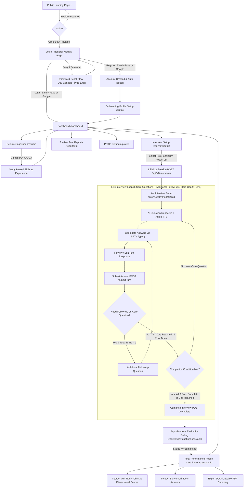
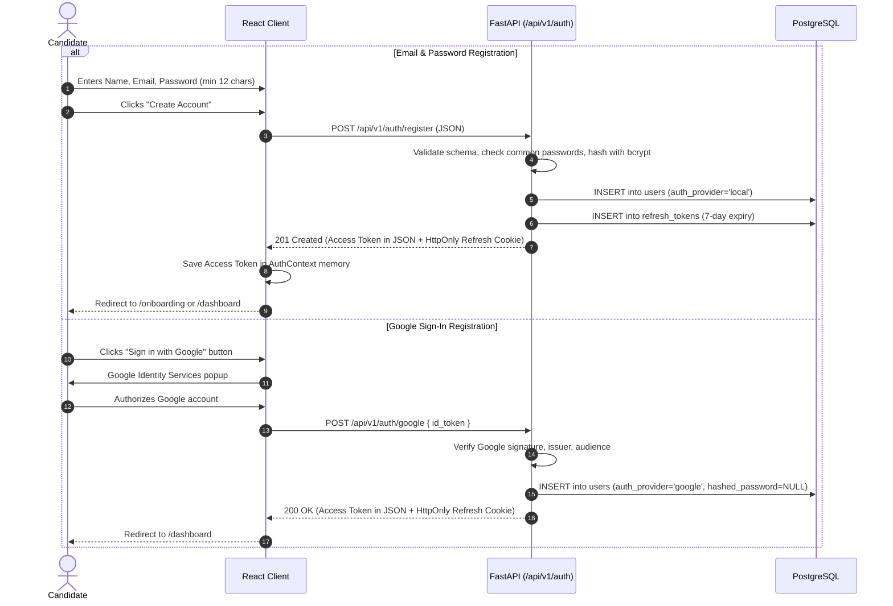
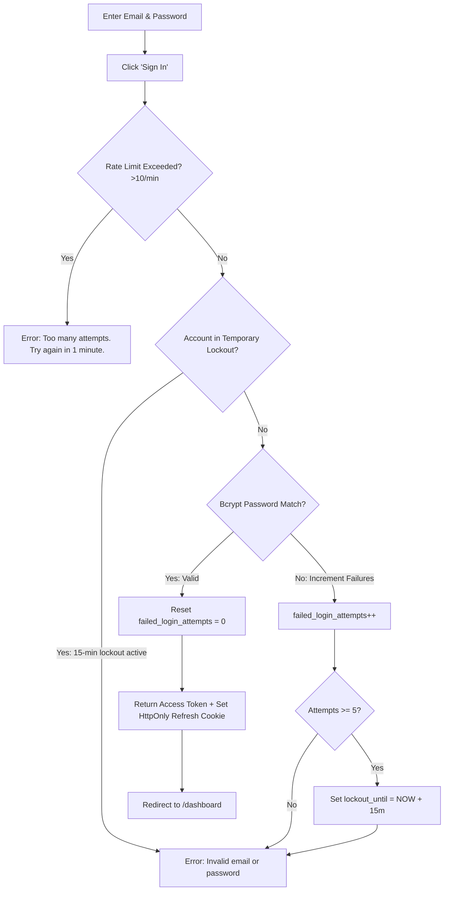
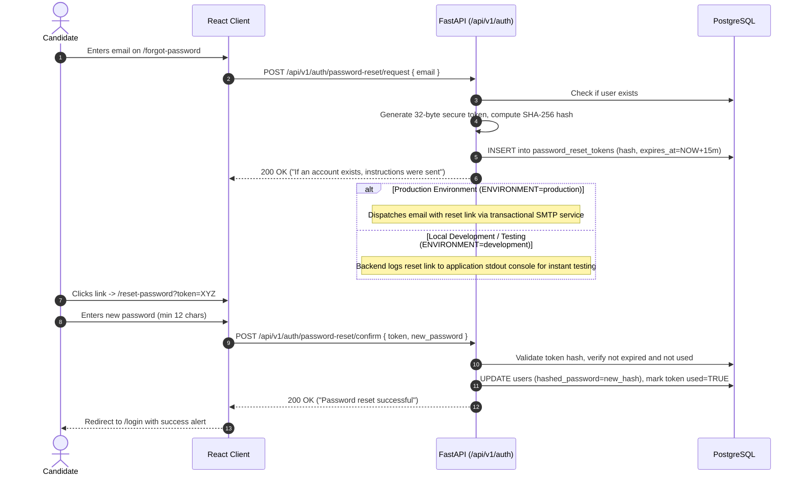
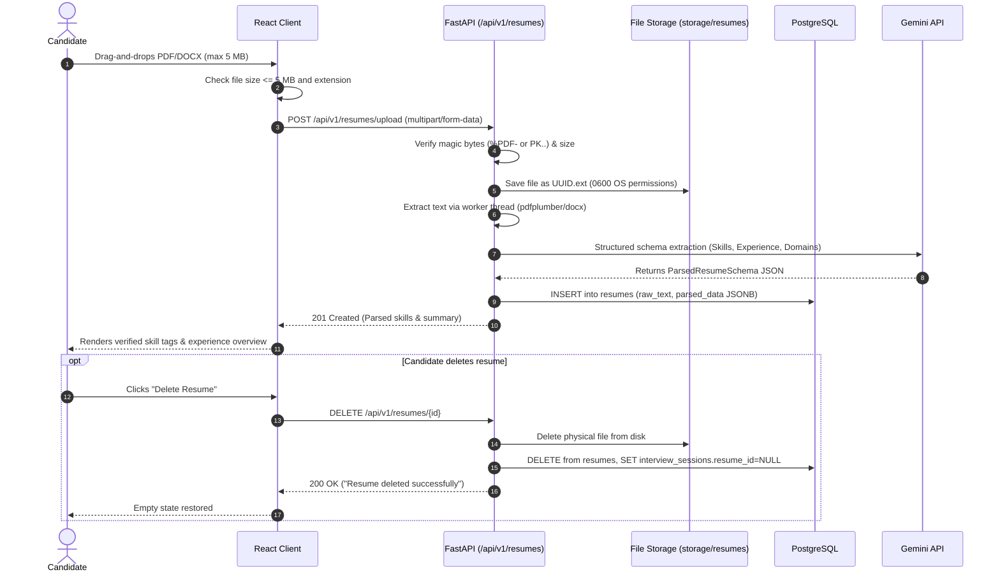
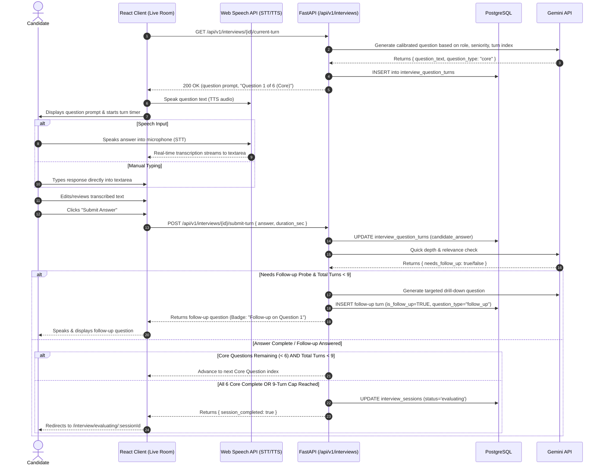
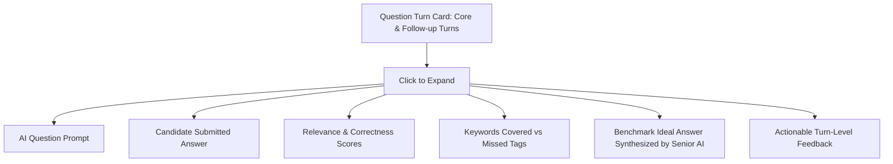
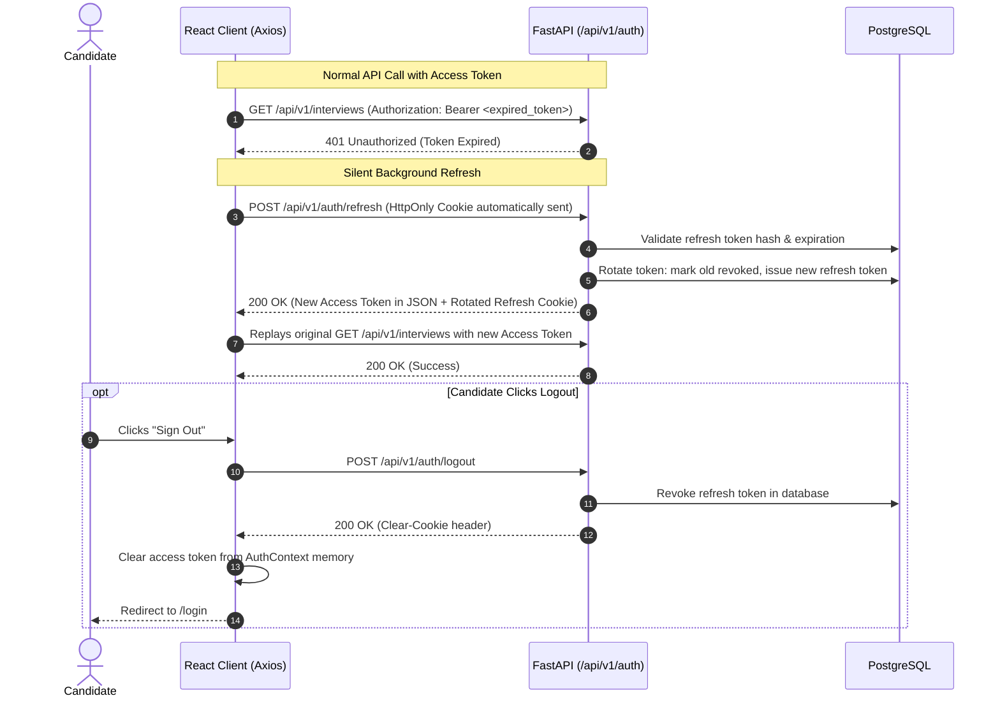

# AROVIA — Complete App Flow & User Journey Document

**Version:** 1.1.0  
**Date:** 2026-08-16  
**Status:** Approved Documentation Baseline  
**Scope:** Candidate Self-Practice & Evaluation Platform (45-Day MVP)  

---

## Executive Summary

This document defines the complete end-to-end user experience, state transitions, authentication gates, error handling paths, and system interactions across the **AROVIA** platform. It provides developers, designers, and testers with an unambiguous blueprint of how a candidate enters, navigates, practices, and receives evaluations on AROVIA.

---

## Table of Contents

1. [Master User Journey Map](#1-master-user-journey-map)
2. [Flow 1: Landing & Public Discovery](#flow-1-landing--public-discovery)
3. [Flow 2: Candidate Signup & Registration](#flow-2-candidate-signup--registration)
4. [Flow 3: Authentication & Login](#flow-3-authentication--login)
5. [Flow 4: Password Reset & Recovery (Production & Local Dev)](#flow-4-password-reset--recovery-production--local-dev)
6. [Flow 5: Candidate Profile Setup & Onboarding](#flow-5-candidate-profile-setup--onboarding)
7. [Flow 6: Candidate Dashboard](#flow-6-candidate-dashboard)
8. [Flow 7: Resume Upload, Inspection & Management](#flow-7-resume-upload-inspection--management)
9. [Flow 8: Interview Configuration & Setup](#flow-8-interview-configuration--setup)
10. [Flow 9: Live Interactive AI Interview Room](#flow-9-live-interactive-ai-interview-room)
11. [Flow 10: Asynchronous Evaluation Processing](#flow-10-asynchronous-evaluation-processing)
12. [Flow 11: Final Interview Performance Report Card](#flow-11-final-interview-performance-report-card)
13. [Flow 12: Turn-by-Turn Score Breakdown & AI Feedback](#flow-12-turn-by-turn-score-breakdown--ai-feedback)
14. [Flow 13: Session History & Progression Analytics](#flow-13-session-history--progression-analytics)
15. [Flow 14: Profile & Account Settings](#flow-14-profile--account-settings)
16. [Flow 15: Silent Token Refresh, Logout & Session Expiry](#flow-15-silent-token-refresh-logout--session-expiry)
17. [Flow 16: Error, Loading, Empty, and Unauthorized States](#flow-16-error-loading-empty-and-unauthorized-states)
18. [Scope Boundaries & Role Clarification](#18-scope-boundaries--role-clarification)

---

## 1. Master User Journey Map



---

## Flow 1: Landing & Public Discovery

### 1.1 Overview
The public landing page introduces candidate visitors to AROVIA's AI-assisted mock interview experience, multi-dimensional scoring capabilities, audio interaction, and sample report visualizations.

- **URL:** `/`
- **Auth Required:** No (Public).

```mermaid
flowchart LR
    Landing[/] --> HeroSection[Hero Banner & Value Prop]
    Landing --> FeatureShowcase[5-Dimension Scoring & Audio Demo]
    Landing --> ActionCTA[Primary CTA: 'Start Free Mock Interview']
    ActionCTA --> AuthCheck{Logged In?}
    AuthCheck -->|Yes| Dashboard[/dashboard]
    AuthCheck -->|No| Register[/register]
```

### 1.2 Flow Details
- **Entry Point:** Direct browser navigation to `/` or search engine arrival.
- **User Actions:**
  - Clicks **"Start Free Mock Interview"** or **"Get Started"** button.
  - Clicks **"Log In"** in the top navigation bar.
  - Scrolls to review interactive sample report cards and audio interview preview animations.
- **System Response:**
  - If candidate is already authenticated (valid in-memory access token or active refresh cookie): Redirects automatically to `/dashboard`.
  - If unauthenticated: Navigates to `/register` or `/login`.
- **Failure / Edge Cases:**
  - *Slow network:* Hero content loads with progressive skeleton UI; static CSS ensures zero layout shift.

---

## Flow 2: Candidate Signup & Registration

### 2.1 Overview
Allows new candidates to register an account using either traditional email/password credentials or Google Sign-In.

- **URL:** `/register`
- **Auth Required:** No (Public).



### 2.2 Flow Details
- **Entry Point:** Navigation from Landing page, or direct access to `/register`.
- **Success Path (Email/Password):**
  1. Candidate fills in Full Name, Email Address, and Password (min 12 characters).
  2. Frontend provides live password length indicator.
  3. Form submits payload to `POST /api/v1/auth/register`.
  4. Backend verifies email uniqueness, rejects known compromised passwords, hashes password with salted `bcrypt` (cost 12), creates user record, generates in-memory access token (15-min) and sets `HttpOnly`, `Secure`, `SameSite=Lax` refresh cookie (7 days).
  5. Candidate is redirected to `/onboarding` to set up their target role.
- **Success Path (Google Sign-In):**
  1. Candidate clicks the Google Sign-In button.
  2. Google Identity Services modal opens; candidate grants consent.
  3. React client forwards `id_token` to `POST /api/v1/auth/google`.
  4. Backend verifies token cryptographic signature, creates user account with `auth_provider='google'`, and sets session tokens.
- **Failure / Edge Cases:**
  - *Email already registered:* Backend returns `409 Conflict` (`{"detail": "An account with this email already exists", "error_code": "EMAIL_EXISTS"}`). Frontend displays an inline alert with a quick link to `/login`.
  - *Password too short (< 12 chars):* Form validation blocks submission; backend enforces Pydantic `min_length=12`.
  - *Commonly used password:* Backend rejects with `422 Unprocessable Entity` (`{"detail": "This password is too common. Please use a stronger passphrase.", "error_code": "WEAK_PASSWORD"}`).
  - *Rate limit exceeded:* Submitting > 3 registrations/minute returns `429 Too Many Requests`.

---

## Flow 3: Authentication & Login

### 3.1 Overview
Handles returning candidate authentication, token issuance, rate limiting, and brute-force mitigation.

- **URL:** `/login`
- **Auth Required:** No (Public).



### 3.2 Google Sign-In Account Collision UX & Flow
When a candidate attempts Google Sign-In with an email that already belongs to an existing local email/password account, AROVIA follows a strict 4-step security and verification workflow to prevent unauthorized account merging:

```
[Candidate clicks 'Sign in with Google']
                     │
                     ▼
[Google verifies email = user@example.com]
                     │
                     ▼ (Backend detects auth_provider='local' exists)
┌─────────────────────────────────────────────────────────────────────────┐
│ STEP 1: UI Prompt                                                       │
│ "This email is already registered with email/password.                  │
│ Please sign in with your password first."                               │
└────────────────────────────────────┬────────────────────────────────────┘
                                     │
                                     ▼ (Candidate logs in with password)
┌─────────────────────────────────────────────────────────────────────────┐
│ STEP 2: Post-Login Linking Confirmation Modal                           │
│ "Would you like to link your Google account to AROVIA?"                 │
│ [Yes, Link Google Account]                 [Not Now / Cancel]           │
└────────────────────────────────────┬────────────────────────────────────┘
                                     │
           ┌─────────────────────────┴─────────────────────────┐
           ▼ (Candidate clicks 'Yes')                          ▼ (Candidate clicks 'Cancel')
┌──────────────────────────────────────┐            ┌──────────────────────────────────────┐
│ STEP 3: Identity Link Verified       │            │ Existing Account Unchanged           │
│ Google OAuth identity linked to user │            │ Password login remains active;       │
│ record in PostgreSQL                 │            │ No Google identity linked            │
└──────────────────┬───────────────────┘            └──────────────────────────────────────┘
                   │
                   ▼
┌─────────────────────────────────────────────────────────────────────────┐
│ STEP 4: Future Sign-In Enabled                                          │
│ Future Google Sign-In or Password login both access the same account    │
└─────────────────────────────────────────────────────────────────────────┘
```

**Security & Collision Rules:**
- **Never Silently Merge:** Accounts are never merged without password re-authentication and explicit candidate consent.
- **No Duplicate Accounts:** The database `users.email` unique constraint strictly prevents creating duplicate accounts for the same verified email address.
- **Preserved State:** If the candidate cancels or declines the linking step, their existing password account remains completely unmodified.

### 3.3 Flow Details
- **Entry Point:** Direct navigation to `/login`.
- **Success Path:**
  1. Candidate inputs registered email and password.
  2. Clicks **"Sign In"** (`POST /api/v1/auth/login`).
  3. Server validates credentials with `bcrypt`, resets `failed_login_attempts` to 0, and returns 15-min Access Token (JSON) and 7-day Refresh Token (HttpOnly Cookie).
  4. React `AuthContext` sets access token in memory and navigates to `/dashboard`.
- **Failure / Edge Cases:**
  - *Invalid Credentials:* Returns generic `401 Unauthorized` (`"Invalid email or password"`) to prevent email enumeration.
  - *Suspicious repeated failures (>= 3):* Progressive backoff adds artificial 2-second delay.
  - *5 consecutive failures:* Account placed in temporary 15-minute lockout (`lockout_until`). Accounts are never permanently locked (preventing attacker denial-of-service).
  - *IP Rate Limit:* Exceeding 10 login requests/minute returns `429 Too Many Requests`.

---

## Flow 4: Password Reset & Recovery (Production & Local Dev)

### 4.1 Overview
Provides secure, time-limited password recovery via high-entropy single-use cryptographic tokens.

- **URLs:** `/forgot-password`, `/reset-password?token=...`
- **Auth Required:** No (Public).



### 4.2 Local Development vs Production Delivery Architecture
To allow seamless local development and automated testing without requiring an external SMTP mail server:

1. **Production Architecture:**
   - Password reset links are dispatched via standard transactional email services (SMTP, SendGrid, Amazon SES).
   - Links point to: `https://arovia.app/reset-password?token=<raw_token>`.

2. **Local Development & Testing Mechanism:**
   - Real SMTP server configuration is **NOT required** for local development.
   - When `ENVIRONMENT=development` or `ENVIRONMENT=testing`, the backend outputs the generated password reset link directly to the application console logger (`stdout`):
     ```text
     [DEV AUTH] Password reset link for candidate user@example.com:
     http://localhost:5173/reset-password?token=e4b7c89a01fd4a8b... (Expires in 15 mins)
     ```
   - **Security Rules for Local Dev Mechanism:**
     - The user's plaintext password is **never logged**.
     - Only the single-use URL link is logged to stdout in development mode.
     - The development console log output is **strictly disabled in production** (`ENVIRONMENT=production`).
     - No unauthenticated, public test-bypass endpoints are exposed in production.

3. **Cryptographic Security Standard:**
   - Generated tokens are 32-byte cryptographically secure strings (`secrets.token_urlsafe(32)`).
   - Only the **SHA-256 hash** of the token is persisted in `password_reset_tokens`.
   - Expiration window is strictly **15 minutes**.
   - Tokens are **single-use**; marked `used=True` immediately upon password change.

---

## Flow 5: Candidate Profile Setup & Onboarding

### 5.1 Overview
Initial guided screen presented after first-time registration to collect primary career targets and seniority preferences.

- **URL:** `/onboarding` (or `/profile`)
- **Auth Required:** Yes (Authenticated Candidate).

```mermaid
flowchart LR
    NewAccount[New Registration] --> OnboardingView[/onboarding]
    OnboardingView --> FormInput[Select Target Role & Seniority]
    FormInput --> SaveProfile[Click 'Complete Setup']
    SaveProfile --> APICall[PUT /api/v1/auth/me]
    APICall --> Success[Redirect to /dashboard]
```

### 5.2 Flow Details
- **Entry Point:** Automatic redirect after initial registration, or editable from `/profile`.
- **User Actions:**
  - Selects primary **Target Role** (e.g., Frontend Developer, Backend Engineer, Full Stack, DevOps, Data Science).
  - Selects **Experience Level** (Junior: 0-2 yrs, Mid: 3-5 yrs, Senior: 5+ yrs).
  - Optionally inputs short professional bio or key target skills.
  - Clicks **"Save & Continue to Dashboard"**.
- **System Response:**
  - Updates candidate's record via `PUT /api/v1/auth/me`.
  - Updates user state in `AuthContext` and transitions to `/dashboard`.
- **Edge Cases:**
  - *Candidate skips onboarding:* Defaults to `target_role: "Full Stack Developer"`, `experience_level: "Junior"`; candidate can update profile anytime.

---

## Flow 6: Candidate Dashboard

### 6.1 Overview
The primary hub where candidates view their readiness status, upload/manage resumes, launch mock interviews, and inspect recent practice reports and score progressions.

- **URL:** `/dashboard`
- **Auth Required:** Yes (Authenticated Candidate).

```mermaid
flowchart TD
    DashboardView[/dashboard] --> QuickActions[Action Cards]
    QuickActions --> StartNew[Start New Interview Setup]
    QuickActions --> UploadResume[Upload / Manage Resume]
    DashboardView --> StatWidgets[Readiness Score & Interview Count]
    DashboardView --> ProgressionChart[Historical Score Progression Line Chart]
    DashboardView --> RecentList[Recent Completed Interviews]
    RecentList --> ViewReport[Open Full Report /reports/:sessionId]
```

### 6.2 Flow Details
- **Entry Point:** Main destination after login or navigation header click.
- **Key Display Elements:**
  - **Welcome Banner:** Greeting with active target role badge.
  - **Quick Start Card:** Primary button **"Start Mock Interview"** (`/interview/setup`).
  - **Resume Status Card:** Shows active resume name, parsed skill count, or prompt to upload.
  - **Overall Performance Progression Chart:** Multi-session score trendline rendered with Chart.js.
  - **Recent Interview History Table:** Last 5 sessions with date, role, score badge, and "View Report" button.
- **Empty State (First-time user):**
  - Shows friendly illustration with 3-step guide: *"1. Upload Resume (Optional) $\rightarrow$ 2. Configure Role $\rightarrow$ 3. Complete 15-min AI Interview"*.

---

## Flow 7: Resume Upload, Inspection & Management

### 7.1 Overview
Enables candidates to upload their resume (PDF/DOCX), triggers background text extraction and Gemini skill parsing, displays extracted competencies for verification, and supports complete data deletion.

- **URL:** `/resume`
- **Auth Required:** Yes (Authenticated Candidate).



### 7.2 Flow Details
- **Entry Point:** Navigation from Dashboard card or navbar link `/resume`.
- **Upload Success Path:**
  1. Candidate selects a `.pdf` or `.docx` file (under 5 MB).
  2. Frontend shows upload progress bar.
  3. Backend verifies magic bytes, saves file with UUID naming in `storage/resumes/` with `0600` permissions, extracts text via threadpool, and queries Gemini for structured skills and experience metadata.
  4. Returns parsed JSON; frontend displays interactive skill tags (e.g. `[Python]`, `[React]`, `[PostgreSQL]`).
- **Deletion Path (Privacy/Retention):**
  1. Candidate clicks **"Delete Resume"** and confirms modal.
  2. `DELETE /api/v1/resumes/{id}` permanently deletes the physical file from disk, deletes the database row, raw text, and parsed JSONB.
  3. Existing completed interview reports retain their historical text without referencing the deleted resume file.
- **Failure / Edge Cases:**
  - *File > 5 MB:* Rejected instantly by client and server (`413 Payload Too Large`).
  - *Corrupted / Fake PDF (e.g. renamed .exe):* Magic byte check fails; returns `422 Unprocessable Entity` (`"Invalid file header signature. Only valid PDF and DOCX documents are accepted."`).
  - *Password-Protected PDF:* Text extraction raises error; returns `422 Unprocessable Entity` (`"Password-protected PDF files cannot be processed. Please upload an unprotected version."`).

---

## Flow 8: Interview Configuration & Setup

### 8.1 Overview
Allows candidates to calibrate the mock interview by configuring their target role, seniority level, interview focus area, and optional job description.

- **URL:** `/interview/setup`
- **Auth Required:** Yes (Authenticated Candidate).

```mermaid
flowchart TD
    SetupView[/interview/setup] --> RoleSelect[Select Target Role: Frontend / Backend / Full Stack / DevOps / Data Science]
    SetupView --> SenioritySelect[Select Seniority: Junior / Mid / Senior]
    SetupView --> FocusSelect[Select Focus: Technical Core / System Design / Behavioral]
    SetupView --> CustomJD[Optional: Paste Target Job Description]
    SetupView --> ResumeToggle{Use Uploaded Resume Context?}

    ResumeToggle -->|Yes: Linked| FormReady[Config Ready: 6 Core Planned Questions]
    ResumeToggle -->|No: Standalone| FormReady

    FormReady --> LaunchBtn[Click 'Start Interview']
    LaunchBtn --> APICall[POST /api/v1/interviews]
    APICall --> SessionCreated[InterviewSession Created: 6 Core Questions, Hard Cap 9 Turns]
    SessionCreated --> RedirectLive[Redirect to /interview/live/:sessionId]
```

### 8.2 Flow Details
- **Entry Point:** Click **"Start Mock Interview"** from Dashboard.
- **User Actions:**
  1. Selects **Target Role** (Standard category or custom job title).
  2. Selects **Seniority Level** (`Junior`, `Mid`, `Senior`).
  3. Selects **Interview Focus** (`Technical Core`, `System Design`, `Behavioral`).
  4. (Optional) Pastes custom Job Description text into textarea.
  5. Toggles whether to incorporate their active uploaded resume context.
  6. Clicks **"Start Interview"**.
- **Interview Structure Baseline:**
  - Configures **6 planned core questions**.
  - Sets **Hard Cap = 9 total turns** (6 core questions + up to 3 additional dynamic follow-ups).
- **System Response:**
  - Backend creates `interview_sessions` record with `status='in_progress'`, total planned core questions = 6, max turns = 9.
  - Redirects client to `/interview/live/{session_id}`.

---

## Flow 9: Live Interactive AI Interview Room

### 9.1 Overview & Turn Structure
The core mock interview environment where candidates listen to AI questions, record or type their answers, receive dynamic follow-ups, and progress through structured interview turns.

- **URL:** `/interview/live/:sessionId`
- **Auth Required:** Yes (Session Owner).

### 9.2 Turn Progression & Completion Rules
To eliminate pacing ambiguity, AROVIA implements a deterministic turn rule:

1. **6 Planned Core Questions:** Every interview has 6 planned core questions calibrated to the candidate's configured role and seniority.
2. **Additional Dynamic Follow-Ups:** When a candidate's answer lacks technical depth, clarity, or omits a critical architectural explanation, the AI generates **1 additional follow-up question** immediately following that core answer.
3. **Hard Cap of 9 Total Turns:** The interview enforces a strict hard ceiling of **9 total turns** (6 core + max 3 dynamic follow-ups across the entire session) to keep mock interviews bounded within a realistic 15–20 minute window.
4. **Completion Conditions:** The live interview automatically completes and transitions to evaluation when:
   - **Condition A:** All 6 core questions (plus any triggered follow-ups) have been answered.
   - **Condition B:** The hard cap of 9 total turns is reached.
   - **Condition C:** The candidate explicitly clicks **"Finish & Submit Early"** (permitted after answering at least 3 questions).



### 9.3 Flow Details
- **Entry Point:** Automatic transition from Setup, or resuming an in-progress session.
- **Turn Counter Display:** Prominently shows progress:
  - For Core Questions: *"Question 3 of 6 (Core)"*
  - For Follow-Up Questions: *"Follow-Up on Question 3"*
- **Answer Input:** Candidate clicks **"Start Speaking"** (Microphone) for real-time STT transcription or types directly into the response box.
- **Editing & Verification:** Candidate can pause, review, and manually edit the transcribed text before submitting.
- **Failure / Edge Cases:**
  - *Browser lacks Speech API support:* STT/TTS controls display fallback badge: *"Speech API not supported in this browser — text input enabled"*.
  - *Accidental browser refresh / close:* Candidate navigates back to `/interview/live/{session_id}`; system restores current active turn state without losing submitted answers.
  - *Submitting blank answer:* Prevented client-side; backend requires non-empty answer string (`min_length=5`).

---

## Flow 10: Asynchronous Evaluation Processing

### 10.1 Overview
A dedicated interstitial processing state while the backend executes the multi-dimensional evaluation pipeline in a background task.

- **URL:** `/interview/evaluating/:sessionId`
- **Auth Required:** Yes (Session Owner).

```mermaid
flowchart TD
    EnterState[/interview/evaluating/:sessionId] --> ShowProgress[Display Animated Processing Spinner & Interview Tips]
    ShowProgress --> StartPolling[Start Polling GET /api/v1/reports/:sessionId/status every 2.5s]

    subgraph "Backend BackgroundTasks"
        BgTask[Async Evaluation Task] --> FetchTurns[Aggregate all Q&A Turns: 6 Core + Follow-ups]
        FetchTurns --> CallGemini[Gemini Structured Evaluation]
        CallGemini --> ValidateSchema[Pydantic Schema Validation & Math Score Calculation]
        ValidateSchema --> SaveReport[INSERT into evaluation_reports status='completed']
    end

    StartPolling --> CheckStatus{Status?}
    CheckStatus -->|'pending' or 'processing'| Wait[Wait 2.5 seconds] --> StartPolling
    CheckStatus -->|'completed'| NavigateReport[Redirect to /reports/:sessionId]
    CheckStatus -->|'failed'| ShowError[Display 'Evaluation encountered an issue' with Retry button]
```

### 10.2 Flow Details
- **Entry Point:** Automatic redirect after submitting the final interview turn.
- **User Experience:**
  - Animated radar graphic and progress indicator.
  - Rotating carousel of interview tips and performance insights.
- **Polling Loop:**
  - Client polls `GET /api/v1/reports/{session_id}/status` every 2.5 seconds.
  - Upon receiving `{"status": "completed"}`, automatically transitions to `/reports/{session_id}`.
- **Failure Handling:**
  - If status returns `'failed'`, presents a clean error card: *"Evaluation generation took longer than expected. Click below to retry scoring."* with a **"Retry Evaluation"** button.

---

## Flow 11: Final Interview Performance Report Card

### 11.1 Overview
The comprehensive post-interview report card presenting overall scores, visual competency charts, top strengths, areas for improvement, and PDF download capabilities.

- **URL:** `/reports/:sessionId`
- **Auth Required:** Yes (Session Owner).

```mermaid
flowchart TD
    ReportView[/reports/:sessionId] --> HeaderBanner[Overall Score Badge & Grade Tier e.g. 84/100 - Excellent]
    ReportView --> VisualAnalytics[Interactive Radar Chart & Dimensional Progress Bars]
    ReportView --> KeyInsights[Strengths & Priority Improvement Areas]
    ReportView --> ActionablePlan[Personalized Study & Improvement Recommendations]
    ReportView --> TurnAccordion[Expandable Turn-by-Turn Analysis: 6 Core + Follow-ups]
    ReportView --> ExportActions[Export Downloadable PDF Report]
```

### 11.2 Flow Details
- **Entry Point:** Direct transition from evaluation processing or opened from Dashboard history.
- **Visual & Analytical Sections:**
  1. **Overall Grade Header:** Large numeric score (0-100), completion date, target role, and seniority level.
  2. **Competency Radar Chart:** Visualizes balance across the 5 evaluation dimensions:
     - Relevance (20%)
     - Technical Correctness (30%)
     - Key Concepts & Keywords (20%)
     - Clarity & Grammar (15%)
     - Communication & Delivery Indicators (15%)
  3. **Top Strengths:** 3-5 verified bullet points highlighting what the candidate executed well.
  4. **Areas for Improvement:** 3-5 prioritized technical gaps identified during the session.
  5. **Actionable Study Recommendations:** Tailored documentation topics and architectural concepts to review.
- **PDF Export Action:**
  - Candidate clicks **"Download PDF Report"**.
  - Client-side `html2canvas` and `jsPDF` render and download `AROVIA_Interview_Report_<sessionId>.pdf`.
- **Edge Cases:**
  - *Unauthorized access:* Attempting to view another candidate's `sessionId` returns `404 Not Found` (preventing IDOR).

---

## Flow 12: Turn-by-Turn Score Breakdown & AI Feedback

### 12.1 Overview
Detailed question-by-question drill-down within the report card comparing the candidate's submitted answer directly against a synthesized benchmark ideal answer.



### 12.2 Flow Details
- **Entry Point:** Scroll down on `/reports/:sessionId`.
- **Display Details Per Turn:**
  - **Question Header:** Question index, turn badge (`Core Question 1` or `Follow-up on Question 1`), and turn duration.
  - **Candidate Response Box:** Verbatim submitted answer text.
  - **Tag Breakdown:**
    - Green Tags: Key technical concepts correctly explained.
    - Red / Outline Tags: Critical concepts omitted or explained inaccurately.
  - **Benchmark Senior Ideal Answer:** Model answer illustrating structured, comprehensive delivery.
  - **Specific Coaching Note:** 1-2 sentence targeted tip on how to upgrade the specific answer.

---

## Flow 13: Session History & Progression Analytics

### 13.1 Overview
Enables candidates to track their improvement over time across multiple practice sessions.

- **URL:** `/dashboard#history` or `/history`
- **Auth Required:** Yes (Authenticated Candidate).

```mermaid
flowchart LR
    HistoryView[/history] --> FilterBar[Filter by Role / Date Range]
    HistoryView --> TrendChart[Historical Score Progression Line Chart]
    HistoryView --> SessionList[Chronological Session Cards]
    SessionList --> ActionBtn[Click 'View Report Card']
    ActionBtn --> ReportPage[/reports/:sessionId]
```

### 13.2 Flow Details
- **Entry Point:** Click **"History"** in navigation bar or Dashboard tab.
- **Key Display Elements:**
  - **Progression Line Chart:** X-axis shows interview dates; Y-axis shows overall score (0-100). Hovering reveals dimensional breakdown tooltip.
  - **Session Archive Table:**
    - Columns: Date, Target Role, Focus, Turns (e.g. "6 Core + 1 Follow-up"), Overall Score Badge, Actions.
    - Action: **"View Report"** link navigating directly to `/reports/{sessionId}`.
- **Empty State:**
  - If candidate has 0 completed sessions: Displays *"No completed mock interviews yet. Launch your first session to begin tracking progress!"*

---

## Flow 14: Profile & Account Settings

### 14.1 Overview
Allows candidates to update their target career goals, bio, change password, or manage linked OAuth providers.

- **URL:** `/profile`
- **Auth Required:** Yes (Authenticated Candidate).

### 14.2 Flow Details
- **User Actions:**
  - Update Full Name, Target Job Role, Experience Level, and Bio $\rightarrow$ `PUT /api/v1/auth/me`.
  - Local Password Account: Change password by entering current password + new password (min 12 chars).
  - Google OAuth Account: Set initial local password via **"Add Password"** flow.
- **Edge Cases:**
  - *Incorrect current password:* Returns `400 Bad Request` (`"Current password incorrect"`).

---

## Flow 15: Silent Token Refresh, Logout & Session Expiry

### 15.1 Overview
Manages the seamless lifecycle of in-memory short-lived access tokens and secure HttpOnly refresh cookies.



### 15.2 Flow Details
- **Silent Refresh Interceptor:** Axios response interceptor catches `401 Unauthorized`. If a refresh is not already in flight, calls `POST /api/v1/auth/refresh`. On success, replays the original failed request seamlessly without user disruption.
- **Session Expiry (Refresh Cookie Expired > 7 days):** If refresh endpoint returns `401`, frontend clears in-memory state and redirects to `/login?session_expired=true` displaying toast: *"Your session has expired. Please sign in again."*
- **Explicit Logout:** Calls `POST /api/v1/auth/logout`, server revokes the DB token and sets `Max-Age=0` on the cookie; client clears in-memory state and redirects to `/login`.

---

## Flow 16: Error, Loading, Empty, and Unauthorized States

### 16.1 State Handling Matrix

| View / Component | Loading State | Empty State | Error State | Unauthorized State |
|---|---|---|---|---|
| **Dashboard** (`/dashboard`) | Skeleton cards for widgets & chart | Friendly illustration with 3-step setup guide | Inline alert with "Retry loading dashboard" button | Redirects to `/login` |
| **Resume Page** (`/resume`) | Animated document scanner pulse | Drag-and-drop upload zone with format guidelines | Error banner explaining validation failure (e.g. invalid MIME) | Redirects to `/login` |
| **Live Interview** (`/interview/live/:id`) | Pulse shimmer on question card during AI generation | N/A (Always displays active turn) | Toast alert with "Retry fetching question" button | Returns 404 (IDOR protection) |
| **Evaluation Waiting** (`/interview/evaluating/:id`) | Radar animation + rotating tip carousel | N/A | Error card with "Retry Evaluation" action | Returns 404 |
| **Report Card** (`/reports/:id`) | Multi-section shimmer layout | N/A | "Report not found" card with link to Dashboard | Returns 404 |
| **Session History** (`/history`) | Table skeleton rows | "No completed mock interviews yet" banner | "Failed to load history" alert | Redirects to `/login` |

---

## 18. Scope Boundaries & Role Clarification

### 18.1 Candidate-Only Self-Assessment Scope (v1 MVP)
To guarantee high technical quality and prevent feature sprawl in the 45-day timeline:
- **Candidate Practice Platform (Active Scope):** 100% of v1 features (Authentication, Resume Ingestion, Config, Live Speech Interview, Evaluation Engine, Analytics Report, History) are built exclusively for the candidate user role.
- **Recruiter / Corporate ATS Portal (Explicitly Out of Scope):**
  - Multi-tenant enterprise recruiter logins, candidate job application boards, candidate screening queues, and applicant tracking system (ATS) webhooks are deferred to `v2` (`V2-RECR-01`).
  - No recruiter roles, permissions, or navigation tabs exist in the v1 application flow.

---

*AROVIA App Flow Document — Baseline Approved for Design & Implementation.*
