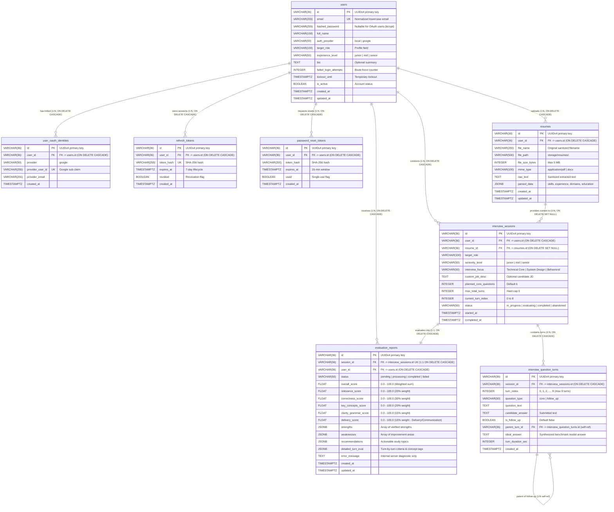

# AROVIA — Backend Database Schema & Data Architecture

**Version:** 1.1.0  
**Date:** 2026-08-16  
**Status:** Approved Data Architecture Baseline  
**Target Milestone:** 45-Day Full-Stack Implementation  

---

## Executive Summary

This document defines the physical and logical database schema, entity relationships, integrity constraints, indexing strategies, data retention policies, and security classifications for the **AROVIA** relational PostgreSQL database.

The data layer is built on **PostgreSQL 16+** using **SQLAlchemy 2.0 Async ORM** and **Alembic** migration version control. The schema balances relational integrity (UUID foreign keys, strict nullability, and check constraints) with performance optimization (JSONB for multi-dimensional AI evaluation matrices and parsed resume structures) while strictly respecting the 45-day MVP scope.

---

## Table of Contents

1. [Entity Relationship Diagram (ERD)](#1-entity-relationship-diagram-erd)
2. [Entity Specifications & Table Definitions](#2-entity-specifications--table-definitions)
   - [2.1 `users` (Candidate Accounts & Profiles)](#21-users-candidate-accounts--profiles)
   - [2.2 `user_oauth_identities` (Google OAuth Providers)](#22-user_oauth_identities-google-oauth-providers)
   - [2.3 `refresh_tokens` (Session Credentials & Rotation)](#23-refresh_tokens-session-credentials--rotation)
   - [2.4 `password_reset_tokens` (Account Recovery)](#24-password_reset_tokens-account-recovery)
   - [2.5 `resumes` (Candidate Documents & Parsed Skills)](#25-resumes-candidate-documents--parsed-skills)
   - [2.6 `interview_sessions` (Mock Interview Runs)](#26-interview_sessions-mock-interview-runs)
   - [2.7 `interview_question_turns` (Q&A Turns)](#27-interview_question_turns-qa-turns)
   - [2.8 `evaluation_reports` (Multi-Dimensional Reports)](#28-evaluation_reports-multi-dimensional-reports)
3. [Score Calculation & Dimensional Weighting](#3-score-calculation--dimensional-weighting)
4. [Constraints & Indexing Strategy](#4-constraints--indexing-strategy)
5. [Data Retention, Privacy & Deletion Policies](#5-data-retention-privacy--deletion-policies)
6. [Security & Sensitive Field Classification](#6-security--sensitive-field-classification)
7. [Layered Rate Limiting & Brute-Force Architecture](#7-layered-rate-limiting--brute-force-architecture)
8. [45-Day MVP Scope & Simplicity Rules](#8-45-day-mvp-scope--simplicity-rules)
9. [Explicit Assumptions & Architectural Decisions](#9-explicit-assumptions--architectural-decisions)

---

## 1. Entity Relationship Diagram (ERD)

---

## 2. Entity Specifications & Table Definitions

### 2.1 `users` (Candidate Accounts & Profiles)
Stores primary authentication credentials, security lockout counters, and candidate career goals.

| Column | Type | Constraints | Description |
|---|---|---|---|
| `id` | `VARCHAR(36)` | `PRIMARY KEY` | UUIDv4 string generated on record creation. |
| `email` | `VARCHAR(255)` | `UNIQUE, NOT NULL` | Normalized lowercase email address (indexed). |
| `hashed_password` | `VARCHAR(255)` | `NULLABLE` | Salted `bcrypt` hash (cost 12). Nullable for pure OAuth2 users. |
| `full_name` | `VARCHAR(150)` | `NOT NULL` | Candidate display name. |
| `auth_provider` | `VARCHAR(50)` | `NOT NULL, DEFAULT 'local'` | Origin of account registration: `'local'` or `'google'`. |
| `target_role` | `VARCHAR(100)` | `NULLABLE` | Desired job role (e.g., "Full Stack Developer"). |
| `experience_level` | `VARCHAR(50)` | `NULLABLE` | Experience seniority tier: `'junior'`, `'mid'`, `'senior'`. |
| `bio` | `TEXT` | `NULLABLE` | Short professional summary or target focus. |
| `failed_login_attempts` | `INTEGER` | `NOT NULL, DEFAULT 0` | Consecutive login failure counter for account-level throttling. |
| `lockout_until` | `TIMESTAMPTZ` | `NULLABLE` | Expiration timestamp for temporary 15-minute brute-force lockout. |
| `is_active` | `BOOLEAN` | `NOT NULL, DEFAULT TRUE` | Account vitality status. |
| `created_at` | `TIMESTAMPTZ` | `NOT NULL, DEFAULT NOW()` | UTC record creation timestamp. |
| `updated_at` | `TIMESTAMPTZ` | `NOT NULL, DEFAULT NOW()` | UTC record update timestamp. |

**`auth_provider` Values & Identity Rules:**
- A local email/password account uses `auth_provider = 'local'`.
- A Google-created account uses `auth_provider = 'google'`.
- If a local account explicitly links a Google identity post-login, the `users.auth_provider` value does **NOT** change to a new enum or separate status; the linked Google identity is represented in the `user_oauth_identities` table.
- A single candidate account may hold both a local password hash and a linked Google identity in `user_oauth_identities` without duplicating OAuth state in the `users` table.

---

### 2.2 `user_oauth_identities` (Google OAuth Providers)
Maintains distinct third-party OAuth links to candidate accounts. This enables explicit account linking, prevents silent merges, and allows a single candidate account to hold both a verified Google identity and an optional local password.

| Column | Type | Constraints | Description |
|---|---|---|---|
| `id` | `VARCHAR(36)` | `PRIMARY KEY` | UUIDv4 identifier. |
| `user_id` | `VARCHAR(36)` | `NOT NULL, FK -> users.id ON DELETE CASCADE` | Candidate account owning this OAuth identity. |
| `provider` | `VARCHAR(50)` | `NOT NULL, DEFAULT 'google'` | OAuth provider identifier (`'google'`). |
| `provider_user_id` | `VARCHAR(255)` | `UNIQUE, NOT NULL` | Unique Google Subject ID (`sub` claim) from verified ID token. |
| `provider_email` | `VARCHAR(255)` | `NOT NULL` | Verified email address supplied by the OAuth provider. |
| `created_at` | `TIMESTAMPTZ` | `NOT NULL, DEFAULT NOW()` | Timestamp when OAuth identity was linked. |

---

### 2.3 `refresh_tokens` (Session Credentials & Rotation)
Persists hashed long-lived refresh credentials. Raw tokens are never stored in the database.

| Column | Type | Constraints | Description |
|---|---|---|---|
| `id` | `VARCHAR(36)` | `PRIMARY KEY` | UUIDv4 identifier. |
| `user_id` | `VARCHAR(36)` | `NOT NULL, FK -> users.id ON DELETE CASCADE` | Candidate account associated with the session. |
| `token_hash` | `VARCHAR(255)` | `UNIQUE, NOT NULL` | SHA-256 hash of the 7-day refresh token. |
| `expires_at` | `TIMESTAMPTZ` | `NOT NULL` | Refresh token expiration timestamp (7 days from issue). |
| `revoked` | `BOOLEAN` | `NOT NULL, DEFAULT FALSE` | Set to `TRUE` upon logout, token rotation, or password reset. |
| `created_at` | `TIMESTAMPTZ` | `NOT NULL, DEFAULT NOW()` | Timestamp when refresh token was issued. |

#### **Refresh Token Rotation Lifecycle**
When `/api/v1/auth/refresh` successfully processes a refresh request:
1. **Validate Presentation:** Extract raw token from the incoming `HttpOnly` `refresh_token` cookie.
2. **Hash & Locate:** Compute SHA-256 hash of the presented token and locate the matching record in `refresh_tokens`.
3. **Check Vitality:** Reject immediately if the token is expired (`expires_at <= NOW()`) or revoked (`revoked == TRUE`).
4. **Revoke Old Token:** Immediately mark the presented token record as `revoked = TRUE`.
5. **Generate New Secret:** Generate a new cryptographically secure 32-byte raw refresh token (`secrets.token_urlsafe(32)`).
6. **Store New Hash:** Insert a new row in `refresh_tokens` containing only the SHA-256 hash of the new token with a fresh 7-day `expires_at`.
7. **Set Secure Cookie:** Set the new raw token in the response `Set-Cookie` header (`HttpOnly; Secure; SameSite=Lax; Path=/api/v1/auth; Max-Age=604800`).
8. **Issue Fresh Access Token:** Return a new 15-minute access token in the JSON response body for React in-memory storage.

*Security Rule:* **Reuse of an already-revoked refresh token is strictly rejected** with HTTP 401 Unauthorized, prompting full re-authentication.

---

### 2.4 `password_reset_tokens` (Account Recovery)
Stores short-lived, single-use password recovery tokens.

| Column | Type | Constraints | Description |
|---|---|---|---|
| `id` | `VARCHAR(36)` | `PRIMARY KEY` | UUIDv4 identifier. |
| `user_id` | `VARCHAR(36)` | `NOT NULL, FK -> users.id ON DELETE CASCADE` | Associated candidate account. |
| `token_hash` | `VARCHAR(255)` | `NOT NULL` | SHA-256 hash of the raw 32-byte URL-safe reset token. |
| `expires_at` | `TIMESTAMPTZ` | `NOT NULL` | Strict 15-minute expiration timestamp. |
| `used` | `BOOLEAN` | `NOT NULL, DEFAULT FALSE` | Marked `TRUE` immediately upon successful password change. |
| `created_at` | `TIMESTAMPTZ` | `NOT NULL, DEFAULT NOW()` | Generation timestamp. |

---

### 2.5 `resumes` (Candidate Documents & Parsed Skills)
Stores candidate resume metadata, isolated storage paths, and AI-extracted structured career summaries.

| Column | Type | Constraints | Description |
|---|---|---|---|
| `id` | `VARCHAR(36)` | `PRIMARY KEY` | UUIDv4 resume identifier. |
| `user_id` | `VARCHAR(36)` | `NOT NULL, FK -> users.id ON DELETE CASCADE` | Candidate account owner. |
| `file_name` | `VARCHAR(255)` | `NOT NULL` | Original uploaded filename (sanitized of path traversal characters). |
| `file_path` | `VARCHAR(500)` | `NOT NULL` | Restricted filesystem path (`storage/resumes/<uuid>.<ext>`) with `0600` permissions. |
| `file_size_bytes` | `INTEGER` | `NOT NULL` | File size (enforced $\le 5\text{ MB}$ / $5,242,880\text{ bytes}$). |
| `mime_type` | `VARCHAR(100)` | `NOT NULL` | Validated MIME type (`application/pdf`, `application/vnd.openxmlformats...`). |
| `raw_text` | `TEXT` | `NOT NULL` | Cleaned plain text extracted via `pdfplumber` or `python-docx`. |
| `parsed_data` | `JSONB` | `NOT NULL` | Structured JSON containing: `skills` (string array), `experience_years` (float), `domains` (string array), and `education` (array). |
| `created_at` | `TIMESTAMPTZ` | `NOT NULL, DEFAULT NOW()` | Upload timestamp. |
| `updated_at` | `TIMESTAMPTZ` | `NOT NULL, DEFAULT NOW()` | Timestamp of schema parsing update. |

---

### 2.6 `interview_sessions` (Mock Interview Runs)
Manages mock interview lifecycle state, role calibration parameters, and turn pacing limits.

| Column | Type | Constraints | Description |
|---|---|---|---|
| `id` | `VARCHAR(36)` | `PRIMARY KEY` | UUIDv4 session identifier. |
| `user_id` | `VARCHAR(36)` | `NOT NULL, FK -> users.id ON DELETE CASCADE` | Candidate conducting the interview. |
| `resume_id` | `VARCHAR(36)` | `NULLABLE, FK -> resumes.id ON DELETE SET NULL` | Optional resume context link (set to `NULL` if resume is deleted). |
| `target_role` | `VARCHAR(100)` | `NOT NULL` | Target job title (e.g., "Backend Engineer"). |
| `seniority_level` | `VARCHAR(50)` | `NOT NULL` | Seniority tier: `'junior'`, `'mid'`, `'senior'`. |
| `interview_focus` | `VARCHAR(50)` | `NOT NULL` | Focus: `'Technical Core'`, `'System Design'`, `'Behavioral'`. |
| `custom_job_desc` | `TEXT` | `NULLABLE` | Optional candidate-pasted target Job Description. |
| `planned_core_questions` | `INTEGER` | `NOT NULL, DEFAULT 6` | Base core question count. |
| `max_total_turns` | `INTEGER` | `NOT NULL, DEFAULT 9` | Absolute hard turn cap (6 core + max 3 dynamic follow-ups). |
| `current_turn_index` | `INTEGER` | `NOT NULL, DEFAULT 0` | Active turn counter: `0, 1, 2, ..., 8` (maximum valid zero-based index for the 9-turn hard cap). |
| `status` | `VARCHAR(50)` | `NOT NULL, DEFAULT 'in_progress'` | State: `'in_progress'`, `'evaluating'`, `'completed'`, `'abandoned'`. |
| `started_at` | `TIMESTAMPTZ` | `NOT NULL, DEFAULT NOW()` | Session start timestamp. |
| `completed_at` | `TIMESTAMPTZ` | `NULLABLE` | Session completion timestamp. |

---

### 2.7 `interview_question_turns` (Q&A Turns)
Stores each individual question prompt, candidate response, and turn metadata.

| Column | Type | Constraints | Description |
|---|---|---|---|
| `id` | `VARCHAR(36)` | `PRIMARY KEY` | UUIDv4 question turn identifier. |
| `session_id` | `VARCHAR(36)` | `NOT NULL, FK -> interview_sessions.id ON DELETE CASCADE` | Parent interview session. |
| `turn_index` | `INTEGER` | `NOT NULL` | Zero-based turn order: `0, 1, 2, ..., 8` (maximum valid zero-based index for the 9-turn hard cap). |
| `question_type` | `VARCHAR(50)` | `NOT NULL, DEFAULT 'core'` | `'core'` or `'follow_up'`. |
| `question_text` | `TEXT` | `NOT NULL` | AI-generated question prompt. |
| `candidate_answer` | `TEXT` | `NULLABLE` | Verbatim text submitted by candidate (via STT or typing). |
| `is_follow_up` | `BOOLEAN` | `NOT NULL, DEFAULT FALSE` | Flag indicating whether turn is a dynamic follow-up probe. |
| `parent_turn_id` | `VARCHAR(36)` | `NULLABLE, FK -> interview_question_turns.id` | Self-referencing link to parent core question if this turn is a follow-up. |
| `ideal_answer` | `TEXT` | `NULLABLE` | AI-synthesized benchmark senior model answer. |
| `turn_duration_sec` | `INTEGER` | `NULLABLE` | Candidate response time in seconds. |
| `created_at` | `TIMESTAMPTZ` | `NOT NULL, DEFAULT NOW()` | Turn generation timestamp. |

---

### 2.8 `evaluation_reports` (Multi-Dimensional Reports)
Stores final aggregated performance metrics, dimensional scores, strengths, improvement areas, and study recommendations.

| Column | Type | Constraints | Description |
|---|---|---|---|
| `id` | `VARCHAR(36)` | `PRIMARY KEY` | UUIDv4 report identifier. |
| `session_id` | `VARCHAR(36)` | `UNIQUE, NOT NULL, FK -> interview_sessions.id ON DELETE CASCADE` | 1-to-1 link to evaluated session. |
| `user_id` | `VARCHAR(36)` | `NOT NULL, FK -> users.id ON DELETE CASCADE` | Candidate identifier for fast history indexing. |
| `status` | `VARCHAR(50)` | `NOT NULL, DEFAULT 'pending'` | Lifecycle: `'pending'`, `'processing'`, `'completed'`, `'failed'`. |
| `overall_score` | `FLOAT` | `NULLABLE, CHECK (0.0 <= overall_score AND overall_score <= 100.0)` | Weighted composite score ($0.0 - 100.0$). |
| `relevance_score` | `FLOAT` | `NULLABLE, CHECK (0.0 <= relevance_score AND relevance_score <= 100.0)` | Relevance dimension score ($20\%$ weight). |
| `correctness_score` | `FLOAT` | `NULLABLE, CHECK (0.0 <= correctness_score AND correctness_score <= 100.0)` | Technical correctness score ($30\%$ weight). |
| `key_concepts_score` | `FLOAT` | `NULLABLE, CHECK (0.0 <= key_concepts_score AND key_concepts_score <= 100.0)` | Key concepts & keywords score ($20\%$ weight). |
| `clarity_grammar_score` | `FLOAT` | `NULLABLE, CHECK (0.0 <= clarity_grammar_score AND clarity_grammar_score <= 100.0)` | Clarity & grammar score ($15\%$ weight). |
| `delivery_score` | `FLOAT` | `NULLABLE, CHECK (0.0 <= delivery_score AND delivery_score <= 100.0)` | Communication & Delivery Indicators ($15\%$ weight). |
| `strengths` | `JSONB` | `NULLABLE` | JSON array of verified candidate strength bullet points. |
| `weaknesses` | `JSONB` | `NULLABLE` | JSON array of prioritized technical improvement areas. |
| `recommendations` | `JSONB` | `NULLABLE` | JSON array of actionable study topics and architectural guides. |
| `detailed_turn_eval` | `JSONB` | `NULLABLE` | JSON array of turn-level scores, covered concepts, and missed concepts. |
| `error_message` | `TEXT` | `NULLABLE` | **Internal server diagnostic only.** Used strictly for server logging and troubleshooting. |
| `created_at` | `TIMESTAMPTZ` | `NOT NULL, DEFAULT NOW()` | Report creation timestamp. |
| `updated_at` | `TIMESTAMPTZ` | `NOT NULL, DEFAULT NOW()` | Report completion timestamp. |

#### **Internal-Only Security Rule for `error_message`**
- `evaluation_reports.error_message` is strictly an **internal diagnostic field** for server-side logging and debugging failed background evaluation tasks.
- It **MUST NOT be returned directly to the candidate in public API responses**.
- Public client error responses must use the existing sanitized envelope (`{"detail": "Evaluation generation encountered an issue. Please retry.", "error_code": "EVALUATION_FAILED"}`).
- Internal LLM provider error details, prompt text, stack traces, SQL syntax, and server filesystem paths must never be leaked across the API layer.

---

## 3. Score Calculation & Dimensional Weighting

### 3.1 Weighted Scoring Formula
The `overall_score` is computed deterministically by the Python backend service (enforced by Pydantic validators) rather than trusting raw LLM math:

$$\text{Overall Score} = (0.20 \times S_{\text{rel}}) + (0.30 \times S_{\text{corr}}) + (0.20 \times S_{\text{key}}) + (0.15 \times S_{\text{clarity}}) + (0.15 \times S_{\text{delivery}})$$

Where:
- $S_{\text{rel}}$ = Relevance Score ($0.0 - 100.0$)
- $S_{\text{corr}}$ = Technical Correctness Score ($0.0 - 100.0$)
- $S_{\text{key}}$ = Key Concepts & Terminology Score ($0.0 - 100.0$)
- $S_{\text{clarity}}$ = Clarity & Grammatical Structure Score ($0.0 - 100.0$)
- $S_{\text{delivery}}$ = Communication & Delivery Indicators Score ($0.0 - 100.0$)

### 3.2 Dimension 5 Scope Definition
The `delivery_score` measures **observable interview-performance signals** (structural flow, answer completeness, decisive phrasing, lack of excessive hesitation markers). It is explicitly documented and disclaimed in the data layer as an **interview performance indicator, NOT a psychological diagnosis or emotional assessment**.

---

## 4. Constraints & Indexing Strategy

### 4.1 Unique Constraints
- `users(email)`: Prevents duplicate accounts.
- `user_oauth_identities(provider_user_id)`: Prevents duplicate linking of the same Google identity.
- `refresh_tokens(token_hash)`: Guarantees unique session tokens.
- `evaluation_reports(session_id)`: Enforces strict 1-to-1 relationship between an interview session and its report.

### 4.2 Database Indexes for Performance Optimization
| Table | Column(s) | Index Type | Purpose |
|---|---|---|---|
| `users` | `email` | `B-Tree` | Instant login credential and registration lookups ($<1\text{ms}$). |
| `user_oauth_identities` | `provider_user_id` | `B-Tree` | Fast OAuth ID token lookups on Google Sign-In. |
| `user_oauth_identities` | `user_id` | `B-Tree` | Fast retrieval of linked identities for profile view. |
| `refresh_tokens` | `token_hash` | `B-Tree` | Silent token refresh lookup on `/api/v1/auth/refresh`. |
| `refresh_tokens` | `user_id, revoked` | `B-Tree` | Rapid session invalidation during password reset or global logout. |
| `password_reset_tokens` | `token_hash` | `B-Tree` | Fast reset token verification on password recovery confirmation. |
| `resumes` | `user_id` | `B-Tree` | Fast active resume lookups for setup and profile. |
| `interview_sessions` | `user_id, status` | `B-Tree` | Fast dashboard queries and active session resumption. |
| `interview_question_turns` | `session_id, turn_index` | `B-Tree` | Ordered turn fetching in live interview room. |
| `evaluation_reports` | `user_id, created_at` | `B-Tree` | High-speed history progression chart and archive queries. |
| `evaluation_reports` | `session_id` | `B-Tree` | Instant report card lookup by session ID. |

---

## 5. Data Retention, Privacy & Deletion Policies

### 5.1 Candidate Data Ownership
The candidate retains absolute ownership over their resume documents, extracted text, and interview transcripts.

### 5.2 Resume Deletion Cascade (`DELETE /api/v1/resumes/{id}`)
When a candidate deletes an uploaded resume:
1. **Physical File Removal:** The backend purges the physical file from the restricted local filesystem (`storage/resumes/<uuid>.<ext>`).
2. **Database Record Deletion:** The corresponding row in `resumes` is deleted, purging the `raw_text` and `parsed_data` JSONB.
3. **Session Preservation (`ON DELETE SET NULL`):** Any `interview_sessions.resume_id` referencing the deleted resume is set to `NULL`. This preserves completed interview transcripts and evaluation reports without retaining the deleted resume document.

### 5.3 Logging & Privacy Guarantee
- Application loggers are **strictly forbidden** from logging raw resume text, candidate contact numbers, street addresses, or PII.
- Passwords and raw authentication/reset tokens are **never logged**.

---

## 6. Security & Sensitive Field Classification

| Data Category | Table & Field | Storage Mechanism | Security Protections |
|---|---|---|---|
| **User Passwords** | `users.hashed_password` | Salted `bcrypt` hash (cost 12) | Plaintext never stored; constant-time verification; nullable for OAuth. |
| **Session Refresh Tokens** | `refresh_tokens.token_hash` | SHA-256 hash | Raw token delivered only in `HttpOnly` `Secure` cookie; hash verified in DB; single-use rotation. |
| **Password Reset Tokens** | `password_reset_tokens.token_hash` | SHA-256 hash | 32-byte high-entropy token; 15-min expiry; single-use flag. |
| **OAuth Identity** | `user_oauth_identities.provider_user_id` | Verified Google `sub` claim | Verified against Google public JWKS keys before insertion. |
| **Resume Documents** | `resumes.file_path` | Local filesystem (`storage/resumes/`) | UUID filename; non-web-accessible directory; OS `0600` permissions. |
| **Interview Transcripts** | `interview_question_turns.candidate_answer` | Plain Text in PostgreSQL | Protected by JWT user isolation; parameterized queries prevent SQLi. |
| **AI Evaluation Reports** | `evaluation_reports.*` | Relational scores + JSONB | Zero-trust ownership query check (`user_id == current_user.id`); IDOR defense returns 404; `error_message` hidden from client. |

---

## 7. Layered Rate Limiting & Brute-Force Architecture

AROVIA protects authentication routes and resources through a clearly partitioned multi-layer security architecture:

1. **Request & IP-Level Rate Limiting (SlowAPI):**
   - Implemented via `slowapi` at the ASGI FastAPI middleware layer.
   - Enforces request ceilings per client IP (e.g., maximum 10 requests/minute on `/api/v1/auth/login`, 3 requests/minute on `/api/v1/auth/register` and `/api/v1/auth/password-reset/request`).
2. **Account-Level Failure Tracking (`users.failed_login_attempts`):**
   - Application logic increments `users.failed_login_attempts` in PostgreSQL upon each failed password attempt on a specific email.
   - Resets to `0` upon successful password authentication.
3. **Progressive Backoff Delay:**
   - When `failed_login_attempts >= 3`, the application service introduces an artificial 2-second sleep delay before returning failure, throttling automated dictionary attacks.
4. **Temporary Account Protection (`users.lockout_until`):**
   - When `failed_login_attempts >= 5`, application logic sets `users.lockout_until = NOW() + INTERVAL '15 minutes'`.
   - Any login attempt during the active lockout window is rejected immediately.
   - **Anti-DoS Guarantee:** Accounts are **never permanently locked**, preventing malicious actors from denying service to legitimate candidates.
5. **Account Enumeration Defense:**
   - All authentication failures (unknown email, bad password, active lockout) return identical HTTP 401 Unauthorized responses with `"Invalid email or password"`.
6. **Role of PostgreSQL:**
   - PostgreSQL provides durable ACID persistence for failure counters, lockout timestamps, and session state.
   - PostgreSQL is **not** the rate-limiting engine itself; request throttling is driven by SlowAPI and FastAPI application logic.

---

## 8. 45-Day MVP Scope & Simplicity Rules

To maintain high development velocity and architectural reliability within the 45-day milestone:

1. **Single PostgreSQL Relational Core:** All structured entities, foreign keys, and JSONB documents reside in one PostgreSQL database.
2. **No External Cache/Broker Infrastructure:** Redis, Celery, and Kafka are excluded from the MVP. Session tokens, rate limits, and report generation are handled natively via PostgreSQL, SlowAPI, and FastAPI `BackgroundTasks`.
3. **No Over-Normalized Metadata Tables:** Strengths, weaknesses, study recommendations, and parsed resume skills are persisted as clean JSONB arrays rather than 6+ unnecessary junction tables.
4. **Direct Filesystem Storage:** Resumes are saved locally on disk outside the web root with restrictive OS permissions, avoiding complex S3/blob storage setup during initial phases.

---

## 9. Explicit Assumptions & Architectural Decisions

1. **Single Active Resume Assumption:** For the MVP, a candidate can upload multiple resumes sequentially, but each mock interview optionally links to their latest active resume (`interview_sessions.resume_id`).
2. **Dedicated OAuth Identity Table vs Embedded Columns:** Decided on a dedicated `user_oauth_identities` table to cleanly support candidates who register via email/password and later explicitly link a Google account (or vice versa) without nullable column sprawl on `users`.
3. **In-Process Report Generation:** Evaluated reports are processed via asynchronous background tasks within the FastAPI application. Report status transitions (`pending` $\rightarrow$ `processing` $\rightarrow$ `completed`) are polled by the client, eliminating external message queue dependencies.
4. **Hard-Capped Turn Engine:** Confirmed structure of 6 planned core questions + up to 3 dynamic follow-ups = maximum 9 total turns (`0, 1, 2, ..., 8`, where 8 is the maximum valid zero-based index for the 9-turn hard cap).

---

*AROVIA Backend Database Schema — Approved Baseline for SQLAlchemy ORM Models & Alembic Migrations.*
