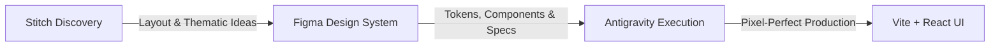

# AROVIA — UX/UI & Visual Identity Design Direction

**Document Version:** 1.0.0  
**Status:** Approved Architectural Design Contract  
**Last Updated:** 2026-08-20  
**Target Milestone:** Post-Phase 7 Visual Track  

---

## 1. Brand Identity & Visual Philosophy

### 1.1 Brand Positioning
**AROVIA — AI Interview Intelligence** is an executive-grade, AI-powered mock interview and multi-dimensional evaluation platform designed for ambitious software engineers and technical leaders.

### 1.2 Aesthetic Core: Luxury Tech + Futuristic AI
AROVIA blends the understated refinement of modern luxury software with the intellectual precision of cutting-edge AI. The visual language conveys competence, authority, and premium craft.

```
       ┌─────────────────────────────────────────────────────────────┐
       │                   LUXURY TECH + FUTURISTIC AI               │
       ├──────────────────────────────┬──────────────────────────────┤
       │           LUXURY TECH        │        FUTURISTIC AI         │
       ├──────────────────────────────┼──────────────────────────────┤
       │ • Understated elegance       │ • Spatial depth & elevation  │
       │ • Generous, balanced spacing │ • Subtle energy sweeps       │
       │ • Refined typography         │ • Dynamic data telemetry     │
       │ • Rich, deep foundation      │ • Responsive micro-motion    │
       └──────────────────────────────┴──────────────────────────────┘
```

### 1.3 Core Visual Attributes
- **Deep Foundation**: Deep slate, midnight obsidian, and layered neutral darks (`#07090e` – `#0f141c`).
- **Controlled Accents**: Sophisticated deep royal blues and cosmic violets, accented with restrained cyan highlights for critical data points and active states.
- **Controlled Glow & Depth**: Translucent surfaces, frosted glassmorphism (`backdrop-filter: blur(16px)`), micro-borders (`1px rgba(...)`), and soft ambient shadows.
- **High-Information Density with Visual Calm**: Dense evaluation metrics and telemetry presented with immaculate breathing room and hierarchy.

### 1.4 Explicit Anti-Patterns (What AROVIA Is NOT)
- ❌ **NO Cyberpunk / Gaming UI**: No harsh angular chamfers, hazard stripes, neon pinks, or HUD gaming overlays.
- ❌ **NO Excessive Neon Overload**: No blinding 100% saturation glows or illegible high-contrast vibrating borders.
- ❌ **NO Generic AI Clipart**: No stock humanoid robots, floating brain illustrations, or literal silicon chip graphics.
- ❌ **NO Cheap Gradients**: No aggressive multi-color rainbow gradients; only smooth, single-family light sweeps.

---

## 2. Design Workflow & Toolchain

The design and implementation pipeline follows a strict three-tier progression:

$$\text{Google Stitch (Visual Exploration)} \longrightarrow \text{Figma (Canonical System)} \longrightarrow \text{Antigravity (Production Code)}$$



1. **Google Stitch**: Rapid visual discovery, theme exploration, structural experimentation, and creative layout mocking.
2. **Figma (Visual Source of Truth)**: Definitive design system tokens, responsive auto-layout specifications, component variants, states (hover, focus, active, disabled), and design handoff specs.
3. **Antigravity (Implementation Engine)**: Translates locked Figma specifications into production-grade, accessible React components and CSS design tokens with zero visual drift.

---

## 3. Responsive Design Strategy

AROVIA is engineered for seamless accessibility across all device categories. **Mobile is treated as a first-class, distinct experience — never as a shrunk or cramped desktop layout.**

```
┌────────────────────────┬────────────────────────┬────────────────────────┐
│   DESKTOP (> 1024px)   │  TABLET (768–1024px)   │    MOBILE (< 768px)    │
├────────────────────────┼────────────────────────┼────────────────────────┤
│ • Multi-column layouts │ • Adaptive 2-column    │ • Strict single-column │
│ • Dual-pane sidebars   │ • Collapsible drawer   │ • Sticky bottom CTA    │
│ • Rich data telemetry  │ • Touch-optimized pads │ • Sheet overlays       │
│ • Hover micro-states   │ • Fluid typography     │ • 48px touch targets   │
└────────────────────────┴────────────────────────┴────────────────────────┘
```

### 3.1 Desktop Viewports ($> 1024\text{px}$)
- Multi-column spatial layout maximizing horizontal real estate without visual noise.
- Side-by-side analysis (e.g., Radar polygon paired with linear metric breakdowns; Candidate Answer side-by-side with Senior Ideal Answer).
- Sophisticated hover micro-interactions, tooltips, and keyboard shortcuts (`Enter` to submit, `Space` for mic toggle).

### 3.2 Tablet Viewports ($768\text{px} - 1024\text{px}$)
- Dynamic 2-column fluid grids with collapsible context sidebars.
- Generous tap targets ($44\text{px} \times 44\text{px}$ minimum) accommodating touch gestures.
- Radar charts scale proportionally with adapted label radii to prevent edge clipping.

### 3.3 Mobile Viewports ($< 768\text{px}$)
- **Dedicated Mobile UX Philosophy**:
  - **Strict Single-Column Flow**: Complex multi-card grids stack vertically in logical order of candidate priority.
  - **Sticky Bottom Action Bar**: Primary action button ("Start Interview", "Submit Answer", "Download PDF") remains fixed at the bottom with safe-area padding for one-thumb reachability.
  - **Drawer & Bottom Sheet Navigation**: Configuration panels and filters slide up as dismissible bottom sheets rather than cramped dropdowns.
  - **Touch Target Integrity**: Minimum $48\text{px} \times 48\text{px}$ hit areas for all interactive controls, toggles, and microphone buttons.
  - **Progressive Disclosure**: Detailed secondary telemetry (e.g. word density stats, detailed rubric rubrics) is collapsed behind clean accordions by default.

---

## 4. Current UI Direction: Interview Setup Screen

The Interview Setup experience establishes the candidate's journey. It maintains the verified functional information architecture while elevating its visual execution to executive luxury standards.

```
┌─────────────────────────────────────────────────────────────────────────┐
│                          AROVIA INTERVIEW SETUP                         │
├────────────────────────────────────┬────────────────────────────────────┤
│ 1. ROLE DEFINITION & SENIORITY     │ 2. CONTEXTUAL DATA & RESUME        │
│ • Curated preset selector          │ • Target Job Description (JD) input│
│ • Junior / Mid / Senior tiers      │ • Active Resume attachment         │
│ • Custom role & skill tag builder  │ • Real-time AI extraction status   │
├────────────────────────────────────┼────────────────────────────────────┤
│ 3. FOCUS DIMENSION & PRACTICE MODE │ 4. SESSION CALIBRATION & LAUNCH    │
│ • Technical Core / Design / Behav. │ • Turn budget & timer preview      │
│ • Full Mock (6Q) vs Quick (3Q)     │ • Dynamic pacing overview          │
│                                    │ • [ ELEVATED 'START INTERVIEW' ]   │
└────────────────────────────────────┴────────────────────────────────────┘
```

### 4.1 Functional Structure (Preserved)
1. **Role Definition**: Target title selection, seniority calibration (`junior`, `mid`, `senior`), and custom engineering domain tags.
2. **Contextual Ingestion**: Custom Job Description textarea (with character count & sanitization indicator) + Candidate Resume selector/uploader.
3. **Focus Calibration**: Three distinct tracks — *Technical Core*, *System Design*, and *Behavioral*.
4. **Session Configuration**: *Full Mock* (6 core questions / 9 max turns / 120s–180s pacing) vs *Quick Practice* (3 core questions / 5 max turns).
5. **Launch Action**: Primary illuminated CTA initiating Turn 0 generation.

### 4.2 Visual & Spatial Refinements
- **Card Proportions & Glass Surfaces**: Deep background containers with 1px luminous edge boundaries (`rgba(255, 255, 255, 0.08)` resting, `rgba(14, 165, 233, 0.5)` active).
- **Typography & Label Alignment**: High-contrast section headers with muted secondary contextual subtitles.
- **Interactive Role Presets**: Segmented pills with smooth state transition glow upon selection.
- **Elevated Launch CTA**: Hero button featuring an internal subtle light sweep and high-contrast typography, establishing unambiguous visual dominance.

---

## 5. Visual Design Principles

### 5.1 Typography Hierarchy
- **Typeface Families**:
  - Primary UI & Headings: `Plus Jakarta Sans` or `Inter` (geometric, legible, modern).
  - Code & Telemetry: `JetBrains Mono` or `Fira Code` (precise, technical, monospace alignment).
- **Type Scale**:
  - `Display / Hero`: $32\text{px} - 40\text{px}$ (800 weight, $-0.03\text{em}$ letter spacing)
  - `Heading 1`: $24\text{px} - 28\text{px}$ (700 weight, $-0.02\text{em}$ letter spacing)
  - `Heading 2`: $18\text{px} - $20\text{px}$ (600 weight, $-0.01\text{em}$ letter spacing)
  - `Body / Standard`: $14\text{px} - 16\text{px}$ (400/500 weight, $1.6$ line height)
  - `Caption / Monospace`: $12\text{px} - 13\text{px}$ (600 weight, monospace)

### 5.2 Spacing & Grid System
- Strict **8-Point Base Spacing Scale**:
  - `2xs`: $4\text{px}$, `xs`: $8\text{px}$, `sm`: $12\text{px}$, `md`: $16\text{px}$, `lg`: $24\text{px}$, `xl`: $32\text{px}$, `2xl`: $48\text{px}$, `3xl`: $64\text{px}$.
- Component padding and inner margins adhere strictly to multiples of 8px (or 4px for compact controls).

### 5.3 Card Treatment & Glassmorphism
- **Base Surface**: `rgba(17, 24, 39, 0.75)` with `backdrop-filter: blur(16px)`.
- **Border**: $1\text{px}$ solid `rgba(255, 255, 255, 0.08)`.
- **Corner Radius**:
  - Outer Containers / Cards: $16\text{px}$ (`--radius-lg`)
  - Inner Controls / Sub-boxes: $10\text{px}$ (`--radius-md`)
  - Badges / Action Pills: $9999\text{px}$ (`--radius-full`)

### 5.4 Button & Control Hierarchy
```
┌───────────────────────────┬───────────────────────────┬───────────────────────────┐
│      PRIMARY BUTTON       │     SECONDARY BUTTON      │       GHOST BUTTON        │
├───────────────────────────┼───────────────────────────┼───────────────────────────┤
│ • Radial cyan/blue glow   │ • Dark glass surface      │ • Transparent background  │
│ • White bold text         │ • 1px subtle white border │ • Accent hover text       │
│ • Active click depression │ • Secondary text color    │ • Zero border resting     │
│ • Dominant page action    │ • Supporting utilities    │ • Auxiliary links/actions │
└───────────────────────────┴───────────────────────────┴───────────────────────────┘
```

### 5.5 Form Controls & Accessibility
- Input backgrounds: Darker than card background (`#090d16`) to create visual indentation / depth.
- Focus Indicator: $2\text{px}$ outer focus ring with subtle cyan glow (`rgba(14, 165, 233, 0.45)`).
- Minimum Contrast Ratio: Meets or exceeds WCAG 2.1 AA standards ($4.5:1$ for body text, $3:1$ for large headings and active interface icons).

---

## 6. 3D & Cinematic Intro Experience Layer

AROVIA features an optional, executive opening reveal designed to immerse the candidate in an elite assessment environment before transitioning into the working dashboard.

### 6.1 Compositional Elements
1. **Geometric Monolith / Logo Reveal**: A refined 3D glass-and-light representation of the AROVIA insignia.
2. **Controlled Light & Energy Sweep**: A thin, high-velocity luminescence sweep highlighting edge contours.
3. **Smooth Workspace Transition**: Camera zooms or fades seamlessly into the application interface with zero jarring layout shifts.

### 6.2 Strict Architectural Separation Rule
> ⚠️ **Experience Layer Isolation Invariant**:
> The 3D intro animation is an isolated splash/onboarding layer. It must **NEVER** be mixed into active interview rooms, response textareas, or live scorecards. Once the candidate enters the interview or dashboard, the interface remains 100% focused, fast, and distraction-free.

---

## 7. Design System Tokens & Reference Placeholders

The following tokens represent the core architectural color and spatial foundations. *Exact final hex values and typography weights will be locked and synchronized from Figma.*

### 7.1 Color Tokens
```css
:root {
  /* Foundation & Dark Surfaces [Figma Baseline] */
  --arovia-bg-foundation: #07090e;        /* Deepest background */
  --arovia-bg-surface: #0e131f;           /* Card / container surface */
  --arovia-bg-surface-elevated: #161c2d;  /* Modal / popover elevation */
  --arovia-bg-input: #0a0d15;             /* Inset control surface */

  /* Primary Brand Accents [To be finalized in Figma] */
  --arovia-brand-blue: #0284c7;           /* Deep luxury blue */
  --arovia-brand-violet: #6366f1;         /* Cosmic indigo / violet */
  --arovia-brand-cyan: #06b6d4;           /* Controlled luminous cyan */
  --arovia-brand-glow: rgba(6, 182, 212, 0.15);

  /* Typography Hierarchy */
  --arovia-text-primary: #f8fafc;         /* 95% White */
  --arovia-text-secondary: #94a3b8;       /* Muted slate */
  --arovia-text-muted: #64748b;           /* Dim text */
  --arovia-text-accent: #38bdf8;          /* Highlight text */

  /* Structural Borders */
  --arovia-border-subtle: rgba(255, 255, 255, 0.08);
  --arovia-border-focus: rgba(14, 165, 233, 0.5);
  --arovia-border-hover: rgba(255, 255, 255, 0.16);

  /* Semantic State Indicators */
  --arovia-state-success: #10b981;        /* Exceptional / Pass */
  --arovia-state-info: #3b82f6;           /* Proficient */
  --arovia-state-warning: #f59e0b;        /* Developing */
  --arovia-state-danger: #f43f5e;         /* Needs Preparation */
}
```

### 7.2 Spacing & Radius Tokens
```css
:root {
  /* Spacing Scale (8pt Grid) */
  --arovia-space-2xs: 4px;
  --arovia-space-xs: 8px;
  --arovia-space-sm: 12px;
  --arovia-space-md: 16px;
  --arovia-space-lg: 24px;
  --arovia-space-xl: 32px;
  --arovia-space-2xl: 48px;
  --arovia-space-3xl: 64px;

  /* Corner Radii */
  --arovia-radius-sm: 6px;
  --arovia-radius-md: 10px;
  --arovia-radius-lg: 16px;
  --arovia-radius-full: 9999px;
}
```

---

## 8. Implementation Governance & Rules

1. **Figma is the Visual Source of Truth**: No ad-hoc styling decisions should bypass the finalized Figma design file.
2. **Zero Functional Disruption**: Visual updates must preserve 100% of underlying API contracts, Pydantic DTO models, and speech/evaluation hooks.
3. **Zero-Cost Invariant (₹0)**: All UI components, animations, charts, and PDF generators must execute client-side or on free-tier services.
4. **Phase 8 Prerequisite Gate**: Phase 8 (Candidate Dashboard & Historical Progress) execution will commence only after the visual design system has been finalized in Figma.

---
*AROVIA Design Direction Document — Canonical Reference*
